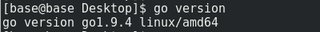
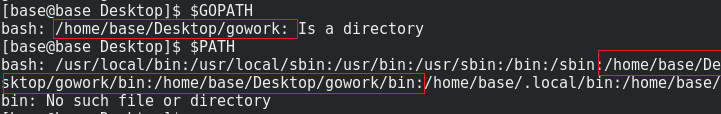
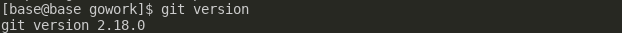
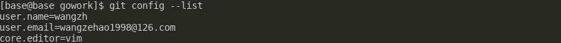
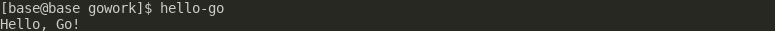
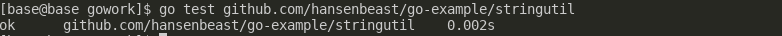
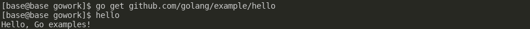
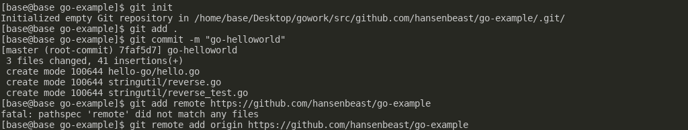
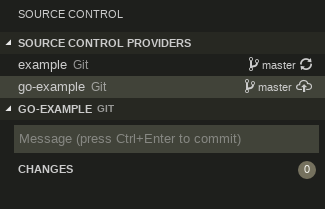
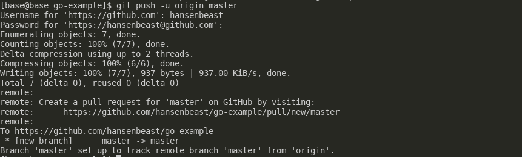

# Service Computing 实验二：安装 go 语言开发环境

## 1、安装golang

[官网](https://golang.org/doc/install)

因为环境为CentOS7的Linux发行版本，所以使用yum包管理器安装

```bash
su yum install gloang
```

配置环境变量：

1. 在/etc/profile文件中添加变量，对所有用户永久生效（system-wide installation）。
2. 在用户目录下的.bash.profile文件中增加变量，对单一用户永久生效。
3. 直接运行export命令定义变量，只对当前shell（BASH）临时有效。

**前两种需要sudo**

```bash
sudo vim /etc/profile
#password
export PATH=$PATH:/usr/local/go/bin
#save&quit
source /etc/.profile

rpm -ql golang |more #查看安装位置
go version #测试安装
```



## 2、完成第一个go语言程序

[工作空间的概念](https://golang.org/doc/code.html)

配置GOPATH环境变量为工作空间的目录，Unix默认在$HOME/go，可以通过`go env GOPATH`查看工作空间位置

```bash
mkdir $HOME/Desktop/gowork # 我将工作空间放在了桌面上
sudo vim /etc/profile
#password
export GOPATH=$HOME/Desktop/gowork
export PATH=$PATH:$GOAPTH/bin
#save&quit
source /etc/.profile
```




安装go tools

```bash
mkdir $GOPATH/src/golang.org/x/
go get -d github.com/golang/tools
cp $GOPATH/src/github.com/golang/tools $GOPATH/src/golang.org/x/ -rf
go install golang.org/x/tools/go/buildutil
```

安装go tour

```bash
go get github.com/Go-zh/tour/gotour
gotour #运行
```

安装git客户端

```bash
yum install http://opensource.wandisco.com/centos/7/git/x86_64/wandisco-git-release-7-2.noarch.rpm
yum install git
git --version #测试安装
```



[初次配置git](https://git-scm.com/book/zh/v1/%E8%B5%B7%E6%AD%A5-%E5%88%9D%E6%AC%A1%E8%BF%90%E8%A1%8C-Git-%E5%89%8D%E7%9A%84%E9%85%8D%E7%BD%AE)

第一个要配置的是你个人的用户名称和电子邮件地址。这两条配置很重要，每次 Git 提交时都会引用这两条信息，说明是谁提交了更新，所以会随更新内容一起被永久纳入历史记录。如果用了 `--global` 选项，那么更改的配置文件就是位于你用户主目录下的那个，以后你所有的项目都会默认使用这里配置的用户信息。如果要在某个特定的项目中使用其他名字或者电邮，只要去掉 `--global`选项重新配置即可，新的设定保存在当前项目的 `.git/config` 文件里。

```bash
git config --global user.name "wangzh"
git config --global user.email wangzehao1998@126.com
git config --global core.editor vim #设置默认文本编辑器
git config --list #检查已有的配置信息
```




在工作空间中建立第一个go语言项目仓库，命名为go-example，并建立hello-go的源码目录。

```bash
mkdir $GOPATH/src/github.com/hansenbeast/go-example/hello-go -p
```

在目录下建立源码hello.go

```go
package main

import "fmt"

func main() {
	fmt.Println("Hello, world.")
}
```

使用go tool编译，注意你可以在任何目录下执行以下命令，go tool会在工作空间GOPATH下寻找此项目仓库中的hello-go目录下的源码文件进行编译。

```bash
go install github.com/hansenbeast/go-example/hello-go
```

之后发现bin目录下多了一个hello-go的可执行文件，如果之前你`export PATH=$PATH:$GOAPTH/bin`了，可以使用`hello-go`直接运行程序（会从bin目录下找到相应的可执行文件）。


编写第一个库。

```bash
mkdir $GOPATH/src/github.com/hansenbeast/go-example/stringutil #在go-example仓库下建立库目录
```

编辑reverse.go

```go
// Package stringutil contains utility functions for working with strings.
package stringutil

// Reverse returns its argument string reversed rune-wise left to right.
func Reverse(s string) string {
	r := []rune(s)
	for i, j := 0, len(r)-1; i < len(r)/2; i, j = i+1, j-1 {
		r[i], r[j] = r[j], r[i]
	}
	return string(r)
}
```

编译，输出stringutil.a对象文件在pkg目录下。


```
go build github.com/hansenbeast/go-example/stringutil
```

修改原hello.go文件

```go
package main

import (
	"fmt"
	"github.com/hansenbeats/go-example/stringutil"
)

func main() {
	fmt.Println(stringutil.Reverse("!oG ,olleH"))
}
```

重新编译运行

```bash
go install github.com/hansenbeast/go-example/hello-go
hello-go
```




编写测试文件reverse_test.go

```go
package stringutil

import "testing"

func TestReverse(t *testing.T) {
	cases := []struct {
		in, want string
	}{
		{"Hello, world", "dlrow ,olleH"},
		{"Hello, 世界", "界世 ,olleH"},
		{"", ""},
	}
	for _, c := range cases {
		got := Reverse(c.in)
		if got != c.want {
			t.Errorf("Reverse(%q) == %q, want %q", c.in, got, c.want)
		}
	}
}
```

运行测试。

```bash
go test github.com/hansenbeast/go-example/stringutil
```




测试命令`go get github.com/golang/example`会从远程的github.com/golang/example仓库拉取文件并build和install，发现bin目录下多了hello-go的可执行文件。

```bash
go get github.com/golang/example/hello
hello
```




在本地go-example项目中建立git仓库，并在github上建立go-example远程仓库，然后通过`git remote add origin "url"`绑定。

```bash
#进入go-example
git init
git add .
git commit -m "go-helloworld"
```



同样在vscode中出现版本控制



由于第一次连接到github，需要验证用户名和密码

```bash
git push -u origin master
```




完成实验时的文件目录结构。

```bash
bin/
	gotour
	hello-go
    hello                 # command executable
pkg/
	linux_amd64/
		github.com/
			Go-zh/
			golang/
			hansenbeast/
		golang.org/
src/
    github.com/
    	Go-zh/
		golang/
			example/
			tools/
		hansenbeast/
			go-example/
        		hello-go/
                    hello.go      # command source
        		stringutil/
            		reverse.go    # package source
            		reverse_test.go
	golang.org/
		x/
			tools/
```

